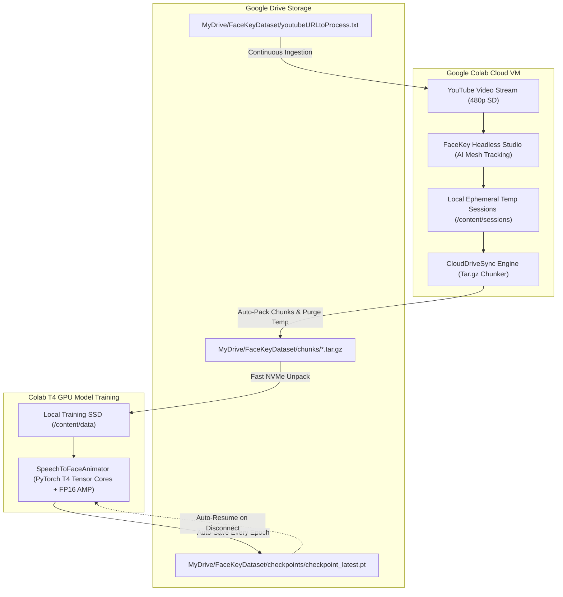

# ☁️ FaceKey Studio — Google Drive & Cloud GPU (Colab / Kaggle) Guide

> **Zero Local Disk Bloat & Free GPU Acceleration**: This guide explains how to bypass your local 5 GB disk limit by running **Data Collection** and **Deep Learning Model Training** directly on **Google Colab** (using free 16 GB NVIDIA T4 GPUs) with automated, chunked storage in **Google Drive**.

---

## 📌 Architecture Overview



---

## 🔑 What You Need

1. **A Google Account**:
   - Access to Google Drive (Free 15 GB tier).
   - Access to [Google Colab](https://colab.research.google.com/) (Free tier with **NVIDIA T4 16GB GPU**).
2. **GitHub Repository**:
   - `https://github.com/Vijay-1010110/FaceKeyAnimation.git`
3. **No Special Software on Your Local PC**:
   - Everything runs in the cloud; your PC disk, CPU, and home bandwidth remain 100% free!

---

## 📦 How the Chunking System Works (Staying Under Disk Limits)

Instead of saving thousands of individual frame files directly to Google Drive (which causes Google Drive FUSE to freeze and exceed file-count limits):
1. **Sessions are recorded into Colab's high-speed local memory**.
2. Every 5 to 10 completed sessions, the **`CloudDriveSync`** engine packages them into a single compressed **`.tar.gz` chunk** (`dataset_chunk_0001.tar.gz`, ~250–500 MB).
3. The chunk is moved to your Google Drive (`MyDrive/FaceKeyDataset/chunks/`).
4. **Local Colab temporary files are immediately wiped** so disk space never runs out.
5. Compression shrinks your dataset size by **~35–40%**, comfortably housing 100 Hours in Google Drive.

---

## 🎬 Part 1: Automated Data Collection on Google Colab

### Step 1: Open the Data Collector Notebook
1. Go to [Google Colab](https://colab.research.google.com/).
2. Select the **GitHub** tab.
3. Enter your repository URL: `https://github.com/Vijay-1010110/FaceKeyAnimation.git`.
4. Open [`notebooks/1_Colab_Data_Collector.ipynb`](file:///d:/AIs/FaceKeyAnimation%20Process/notebooks/1_Colab_Data_Collector.ipynb).

### Step 2: Run Setup Cells
1. **Mount Google Drive**: Run the first code cell and grant Google Drive permission. It creates:
   ```text
   Google Drive/
   └── MyDrive/
       └── FaceKeyDataset/
           ├── chunks/                     <- Stores compressed dataset chunks
           ├── checkpoints/                <- Stores model weights
           ├── dataset_manifest.json       <- Tracks hours, frames, and video titles
           └── youtubeURLtoProcess.txt    <- Your active URL queue
   ```
2. **Clone & Install Dependencies**: Runs `git clone` and installs `yt-dlp`, `mediapipe`, and `opencv-python-headless`.

### Step 3: Add YouTube URLs
Open `youtubeURLtoProcess.txt` inside your Google Drive (or use the notebook cell) and paste YouTube links:
```text
https://www.youtube.com/watch?v=MjduMAagEDk
https://www.youtube.com/watch?v=dQw4w9WgXcQ
```
> [!TIP]
> **Continuous Ingestion**: You can keep adding new YouTube links to this file even while Colab is running. FaceKey auto-detects new links every few seconds without stopping active recordings!

### Step 4: Start Ingestion
Run the collector cell:
```bash
!python scripts/cloud_data_collector.py --drive-dir "/content/drive/MyDrive/FaceKeyDataset" --chunk-size 5 --quality 480p
```
- It streams each video in **480p silent headless mode**.
- Packs sessions into `.tar.gz` chunks on Google Drive.
- Cleans Colab local disk after each chunk.
- If Colab disconnects, simply re-run the notebook: **it reads the queue from Drive and resumes from the exact save point!**

---

## 🧠 Part 2: Accelerated Deep Learning Training (T4 GPU Boosted)

### Step 1: Open the Model Trainer Notebook
1. Open [`notebooks/2_Colab_Model_Trainer.ipynb`](file:///d:/AIs/FaceKeyAnimation%20Process/notebooks/2_Colab_Model_Trainer.ipynb) in Google Colab.
2. In the Colab menu, ensure GPU is active:
   - Click **Runtime** $\rightarrow$ **Change runtime type** $\rightarrow$ Select **T4 GPU** $\rightarrow$ **Save**.

### Step 2: Launch Training with Tensor Core Acceleration
Run the training command:
```bash
!python scripts/train_speech_to_animation.py \
    --drive-dir "/content/drive/MyDrive/FaceKeyDataset" \
    --epochs 50 \
    --batch-size 64 \
    --lr 0.0001 \
    --seq-len 64
```

### ⚡ Resource Optimization & Boost Features
- **Automatic Mixed Precision (AMP FP16)**: Utilizes NVIDIA T4 Tensor Cores (`torch.cuda.amp.autocast()`) for $2\times$ faster training throughput and half the VRAM.
- **Fast NVMe Extraction**: Before training begins, chunks from Google Drive are extracted to Colab's fast local SSD (`/content/training_data/`), eliminating Drive read latency.
- **Pinned Memory DataLoader**: Uses `pin_memory=True` with multi-core workers for zero-copy CPU-to-GPU data streaming.
- **Auto-Resume Protection**:
  - Checkpoints are saved to Google Drive: `MyDrive/FaceKeyDataset/checkpoints/checkpoint_latest.pt` and `checkpoint_best.pt`.
  - If Colab expires (after 6–12 hours), re-running the notebook **automatically detects the Drive checkpoint and resumes from the exact saved epoch and step**!

---

## 📊 Storage Planning: 100 Hours vs. 1,000 Hours

Based on empirical measurements from compressed animation sessions (~490.6 MB per hour of uncompressed `.npz` arrays, and ~310 MB per hour compressed in `.tar.gz` chunks):

| Milestone | Total Stream Time | Total Frames (30 FPS) | Raw NPZ Disk Size | Compressed Drive Chunks |
|---|---|---|---|---|
| **Current Progress** | **3.33 hours** | 218,709 frames | 1.63 GB | **~1.05 GB** |
| **Phase 1 Target** | **100 Hours** | 10.8 Million frames | 47.9 GB | **~30 – 35 GB** |
| **Long-Term Scaling** | **1,000 Hours** | 108.0 Million frames | 479.1 GB | **~300 – 350 GB** |

### 💡 Managing Google Drive Free Storage:
- A free Google account includes **15 GB**.
- For Phase 1 (~30 GB compressed):
  - **Option A**: Use two free Google accounts (switching Drive folders).
  - **Option B**: Download older `.tar.gz` chunks to an external hard drive when needed.
  - **Option C**: Upgrade to Google One 100 GB tier ($1.99/mo) during Phase 1 training.
- Because data is stored in modular `.tar.gz` chunks, you can move chunks anywhere freely without breaking the dataset!
