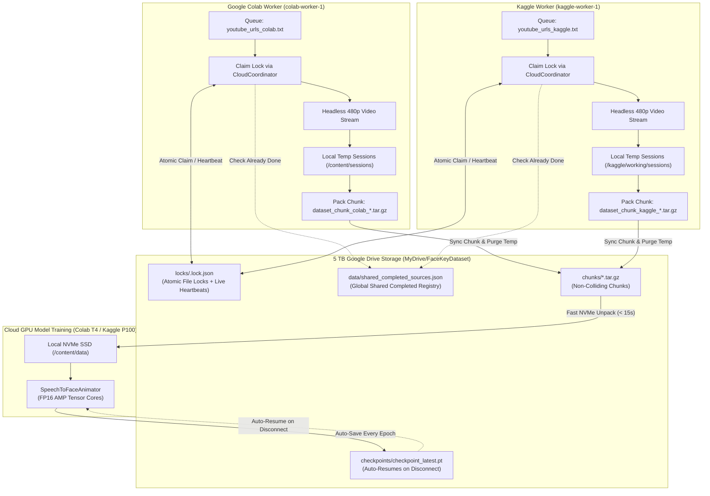

# ☁️ FaceKey Studio — 5 TB Google Drive & Multi-Cloud (Colab + Kaggle) Guide

> **Zero Local Disk Bloat (< 5 GB) & Free Multi-GPU Acceleration**: This guide explains how to bypass your local 5 GB disk limit by utilizing your **5 TB Google Drive Plan (18 Months)** and running **Data Collection** and **Deep Learning Model Training** concurrently across **Google Colab** (Free 16 GB T4 GPU) and **Kaggle** (Free 16 GB P100 / Dual T4 GPUs) with zero duplicate downloads and automatic crash/session recovery.

---

## 📌 Architecture: Parallel Multi-Worker Coordination



---

## 💾 5 TB Google Drive Capacity & Milestone Breakdown

You have an active **5 TB Google Drive Plan for 18 months**, giving you ~5,000 GB of high-speed cloud storage. Storage space is no longer a bottleneck:

| Milestone | Total Hours | Total Frames (30 FPS) | Raw Size | Compressed `.tar.gz` Chunks | % of Your 5 TB Drive |
| :--- | :--- | :--- | :--- | :--- | :--- |
| **Current Dataset** | **3.33 Hours** (32 sessions) | 218,709 frames | 1.63 GB | ~1.05 GB | **0.02%** |
| **Phase 1 Target** | **100 Hours** | ~10,800,000 frames | ~48.0 GB | **~30 – 35 GB** | **0.65%** |
| **Scale Target** | **1,000 Hours** | ~108,000,000 frames | ~480.0 GB | **~300 – 350 GB** | **6.5%** |
| **Maximum Capacity** | **14,000+ Hours** | ~1.5 Billion frames | ~7,000 GB | **~4,800 GB** | **96.0%** |

> [!NOTE]
> Even reaching the 1,000 Hours milestone takes less than 7% of your 5 TB storage!

---

## 🔒 Parallel Execution & Redundancy Prevention (How Colab & Kaggle Work Together)

To maximize data ingestion, you can run Google Colab and Kaggle at the exact same time without running into duplicate downloads or race conditions:

### 1. Dedicated Queue Files
To keep your workflows organized, links are partitioned into distinct queue files:
- **`sessions/youtube_urls_colab.txt`** (or in Drive: `MyDrive/FaceKeyDataset/youtube_urls_colab.txt`):
  - Ingests Big Think lectures, Huberman Lab, TED/TEDx talks, Talks at Google, and CS50.
- **`sessions/youtube_urls_kaggle.txt`** (or in Drive: `MyDrive/FaceKeyDataset/youtube_urls_kaggle.txt`):
  - Ingests MIT OpenCourseWare, Stanford Online, Closer to Truth, Lex Fridman, and Numberphile.
- **`sessions/youtubeURLtoProcess.txt`**:
  - Master shared queue containing all 351 curated talking-head videos.

### 2. Distributed Atomic Locking (`locks/<video_id>.lock.json`)
Before downloading or processing any video, a worker calls `CloudCoordinator.try_claim_url()`:
1. Checks the shared global completion database (`shared_completed_sources.json`) on Google Drive. If the video was already processed by *any* worker, it skips it immediately.
2. Checks if an active lock exists in `MyDrive/FaceKeyDataset/locks/<video_id>.lock.json`.
3. If free, writes an atomic lock containing the worker's ID and timestamp.
4. Starts a background heartbeat thread that refreshes the lock timestamp every 30 seconds.

### 3. Session Expiration & Stale Lock Auto-Recovery
Cloud GPU sessions (Colab 6–12 hr timeouts, Kaggle 12 hr preemptions) can disconnect or crash unexpectedly:
- If a session terminates in the middle of a video, the heartbeat stops.
- If a lock's heartbeat is older than **20 minutes**, `CloudCoordinator` marks it as **stale**.
- The next active worker (or the same worker after reconnecting) automatically reclaims the abandoned video and continues processing from that save point without human intervention!

### 4. Non-Colliding Dataset Chunks
Each worker prefixes chunk archives with its worker tag and timestamp:
`dataset_chunk_colab-worker-1_20261003_104850_0001.tar.gz`
`dataset_chunk_kaggle-worker-1_20261003_105020_0002.tar.gz`
Chunks are merged into `dataset_manifest.json` on Google Drive with retry-safe atomic file writing.

---

## 🎬 How to Run: 3 Ready-to-Run Cloud Notebooks

All notebooks are pre-built and located in the `notebooks/` directory of the repository:

### 1️⃣ Google Colab Data Collector
- **Notebook**: [`notebooks/1_Colab_Data_Collector.ipynb`](file:///d:/AIs/FaceKeyAnimation%20Process/notebooks/1_Colab_Data_Collector.ipynb)
- **Runtime**: Free Standard CPU or T4 GPU.
- **Steps**:
  1. Open Colab $\rightarrow$ GitHub tab $\rightarrow$ enter `https://github.com/Vijay-1010110/FaceKeyAnimation.git`.
  2. Run **Cell 1** to mount your 5 TB Google Drive (`/content/drive`).
  3. Run **Cell 2 & 3** to install dependencies and view `youtube_urls_colab.txt`.
  4. Run **Cell 4** to start the collector:
     ```bash
     !python scripts/cloud_data_collector.py \
         --drive-dir "/content/drive/MyDrive/FaceKeyDataset" \
         --worker-id "colab-worker-1" \
         --urls-file "/content/drive/MyDrive/FaceKeyDataset/youtube_urls_colab.txt" \
         --chunk-size 5 \
         --quality 480p
     ```

---

### 2️⃣ Kaggle Data Collector & Trainer
- **Notebook**: [`notebooks/3_Kaggle_Data_Collector_and_Trainer.ipynb`](file:///d:/AIs/FaceKeyAnimation%20Process/notebooks/3_Kaggle_Data_Collector_and_Trainer.ipynb)
- **Runtime**: Kaggle Free GPU (NVIDIA P100 or 2x T4, 30 hrs/week).
- **Steps**:
  1. Go to [Kaggle Notebooks](https://www.kaggle.com/code) $\rightarrow$ **New Notebook**.
  2. Settings: **Accelerator = GPU P100** and **Internet = On**.
  3. In the right panel, optionally click **+ Add Input $\rightarrow$ Google Drive** to link your Drive folder.
  4. Run the collector cell concurrently with Colab:
     ```bash
     !python scripts/cloud_data_collector.py \
         --drive-dir "/kaggle/working/FaceKeyDataset" \
         --worker-id "kaggle-worker-1" \
         --urls-file "sessions/youtube_urls_kaggle.txt" \
         --chunk-size 5 \
         --quality 480p
     ```

---

### 3️⃣ Accelerated Model Training (Colab T4 or Kaggle P100)
- **Notebook**: [`notebooks/2_Colab_Model_Trainer.ipynb`](file:///d:/AIs/FaceKeyAnimation%20Process/notebooks/2_Colab_Model_Trainer.ipynb)
- **Runtime**: NVIDIA T4 16GB GPU (Colab) or NVIDIA P100 (Kaggle).
- **Steps**:
  1. Mount Google Drive.
  2. Run Cell 2: unpacks all `.tar.gz` chunks from Drive into fast local NVMe SSD (`/content/training_data/`) in under 15 seconds.
  3. Run Cell 3: launches training with Tensor Core FP16 Automatic Mixed Precision (`torch.cuda.amp.autocast()`) and multi-worker DataLoader:
     ```bash
     !python scripts/train_speech_to_animation.py \
         --data-dir "/content/training_data" \
         --checkpoint-dir "/content/drive/MyDrive/FaceKeyDataset/checkpoints" \
         --batch-size 64 \
         --epochs 50 \
         --fp16 \
         --num-workers 4
     ```
  4. Checkpoints (`checkpoint_latest.pt`, `checkpoint_best.pt`) save directly to Drive. If a 12-hour session expires, re-running automatically resumes from the saved epoch!

---

## 🛠️ Local Machine Option (Optional Background Running)

If you also want to run silent batch processing locally while keeping disk usage $< 5\text{ GB}$:
1. Open [`launcher.py`](file:///d:/AIs/FaceKeyAnimation%20Process/launcher.py) and select option **`[3] Silent Batch YouTube Stream Runner`** or double-click **`BATCH_YOUTUBE_STREAM.bat`**.
2. To point to your Google Drive backup folder locally:
   ```powershell
   d:\python_3.11\python.exe scripts\cloud_data_collector.py --worker-id "local-pc" --urls-file "sessions/youtubeURLtoProcess.txt" --chunk-size 5
   ```
